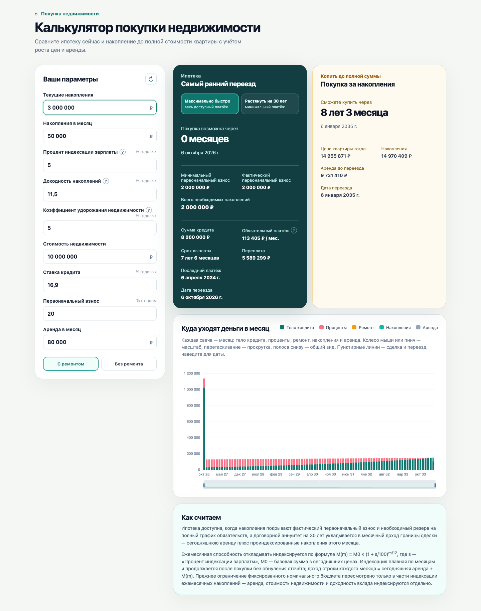
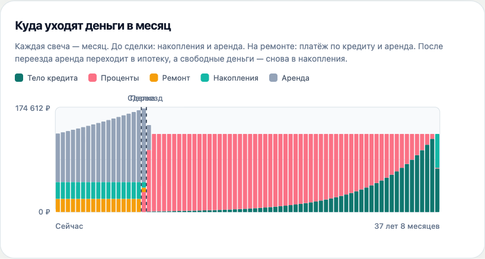

# ⌂ Калькулятор покупки недвижимости

Сравнивает **ипотеку сейчас или после накопления** и **покупку за накопления** с учётом роста цен на жильё, аренды, ремонта и доходности накоплений — и показывает, когда покупка и переезд станут доступными. Все расчёты выполняются локально в браузере.

[](https://vchekryzhov.github.io/home-purchase-calculator/)

[](https://github.com/Vchekryzhov/home-purchase-calculator/actions/workflows/ci.yml)
[](https://github.com/Vchekryzhov/home-purchase-calculator/actions/workflows/codeql.yml)
[](https://github.com/Vchekryzhov/home-purchase-calculator/actions/workflows/deploy-pages.yml)
[](https://codecov.io/gh/Vchekryzhov/home-purchase-calculator)
[](https://github.com/Vchekryzhov/home-purchase-calculator/blob/main/package.json)


## Что отвечает калькулятор

- **Ипотека сейчас или после накопления** — когда накопятся фактический взнос и необходимый резерв; условия кредита на тот момент: сумма, платёж, срок, переплата, дата последнего платежа.
- **Копить до полной суммы** — когда накоплений хватит на растущую цену квартиры и резерв; сколько вы заплатите за аренду до переезда.
- **Ремонт и аренда до переезда** — «Без ремонта» добавляет ремонт после покупки; переезд = сделка + срок работ, аренда идёт до окончания ремонта.
- **Самый ранний выполнимый переезд** — критерий выбора плана, а не минимум суммарных затрат.

Сценарии погашения: **«Максимально быстро»** — всё сверх защищённого резерва идёт на досрочное погашение, или **«Растянуть на 30 лет»** — договорной аннуитет, свободные деньги копятся по ставке вклада.

Цель накоплений = фактический взнос + накопления на ремонт + резерв на временный дефицит; необязательный излишек показывается отдельно.

<details>
<summary>Ещё скриншоты</summary>




</details>

## Куда уходят деньги в месяц

Диаграмма — стековые свечи с реальными потоками по месяцам: тело кредита, проценты, ремонт, накопления и аренда. «Накопления» — остаток дохода после реальных платежей, а не весь запас денег; месячный дефицит, покрываемый резервом, показывается полностью. Пунктирные линии — сделка и переезд выбранного плана.

График интерактивный: масштаб — колесо мыши или пинч, прокрутка — перетаскивание, полоса снизу — общий вид, наведение на свечу — точные суммы за месяц.



## Параметры

| Параметр | По умолчанию | Пояснение |
| --- | --- | --- |
| Текущие накопления | 0 ₽ | Что уже отложено |
| Накопления в месяц | 50 000 ₽ | База, растущая с индексацией зарплаты |
| Процент индексации зарплаты | 5 % | Годовой рост способности откладывать |
| Доходность накоплений | 11,5 % | Годовая ставка вклада/инвестиций |
| Коэффициент удорожания недвижимости | 5 % | Индексирует цену жилья, аренду и ремонт |
| Стоимость недвижимости | 10 000 000 ₽ | Цена квартиры сегодня |
| Ставка кредита | 16,9 % | Годовая ставка по ипотеке |
| Первоначальный взнос | 20 % | Обязательный минимум от цены на дату сделки |
| Аренда в месяц | 80 000 ₽ | Задаёт постоянную часть месячного дохода |
| Состояние квартиры | С ремонтом | «Без ремонта» включает сценарий ремонта |
| Стоимость ремонта | 15 % от цены квартиры | Подставляется автоматически |
| Срок ремонта | 6 мес | Длительность работ после сделки |

## Как считаем

- Месячный доход = сегодняшняя аренда + накопления, индексируемые процентом зарплаты; растёт только способность откладывать, не аренда и не цены.
- Фактический взнос — наименьший допустимый: процентный минимум или сумма, при которой 30-летний аннуитет не превышает доход границы сделки.
- Необходимый резерв — накопленная дисконтированная нехватка денег по обязательному графику; ранние излишки покрывают поздний дефицит.
- Ремонт индексируется к сделке и оплачивается равными платежами: часть закрывает свободный доход, остальное — заранее накопленный резерв.
- Погашение — быстрое (досрочные платежи сверх защищённого резерва) или договорной аннуитет на 30 лет с накоплением свободных денег.
- Покупка за накопления — тот же расчёт «доход + резерв» без ипотеки.
- Выбирается самый ранний выполнимый переезд в горизонтах поиска 30/60 лет.

Полная методика — в блоке «Как считаем» на самой странице приложения и в [docs/METHODOLOGY.md](docs/METHODOLOGY.md).

## Мобильная версия

Адаптивная вёрстка — удобно пользоваться с телефона:

<details>
<summary>Показать мобильный вид</summary>


</details>

## Запуск локально

Требуется Node.js ≥ 22.13.

```bash
npm install
npm run dev      # http://localhost:5173
npm test         # Vitest: модель и characterize-тесты, порог покрытия ≥ 80 %
npm run build    # сборка в dist/
```

## Деплой и проверки

Изменения попадают в `main` через pull request. Обязательные проверки CI — сборка, тесты и покрытие ≥ 80 %, а также анализ CodeQL. После слияния GitHub Actions автоматически публикует сборку на GitHub Pages.

## Стек

- [Vue 3](https://vuejs.org/) + [Vite](https://vite.dev/)
- Компонент `src/App.vue` + чистая финансовая модель в `src/lib/` (покрыта тестами Vitest)
- График — [ECharts](https://echarts.apache.org/) (зум, прокрутка, тултипы); без UI-библиотек
